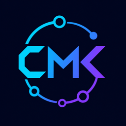

<p align="center">
  
</p>

# CMK Flow

Modulares Custom-Node-Paket für ComfyUI.

**Deutsch** · [English](README.en.md)

[Quellcode](https://github.com/CMKFlow/cmk_nodes) · [Dokumentation](#dokumente) · [Freiwillig unterstützen](https://paypal.me/CMKFlow)

Copyright (C) 2026 Carsten Kirschner

CMK Flow verfolgt zwei klar getrennte Konzepte:

```text
CMK **** -Pipe- → geschlossenes, geführtes Ökosystem
übrige Nodes    → offener Experimentierkasten
```

Der verbindliche Architektur- und Schnittstellenvertrag steht in [`ARCHITECTURE.md`](ARCHITECTURE.md).

## Inspiration und Anerkennung

Der [ComfyUI LoRA Manager von willmiao](https://github.com/willmiao/ComfyUI-Lora-Manager)
hat die Erwartungen an den CMK Flow Browser wesentlich mitgeprägt. Seine direkt
aus ComfyUI geöffnete Browseroberfläche für Checkpoints, LoRAs, Metadaten und
Civitai-Inhalte zeigte eindrucksvoll, wie komfortabel eine integrierte
Verwaltungsoberfläche sein kann.

CMK Flow ist ein eigenständiges Projekt ohne offizielle Verbindung zum LoRA
Manager. Diese Nennung würdigt die gestalterische Inspiration und die umfangreiche
Arbeit hinter dem Open-Source-Projekt; sie behauptet keine Übernahme von Code.

## Einstieg

Der zentrale Einstieg ist der `CMK Flow Browser`. Er stellt die aktuellen
Flow-Module, den offenen Baukasten und die kuratierten Referenzworkflows direkt
in ComfyUI bereit.

Die beiden Modellfamilien besitzen getrennte, typgesicherte Prozesspfade:

```text
SDXL: 01 → 05 optional → 10 → 20 → 25 optional → 30 optional → 40 optional → 90
ZIT:  01 → 05 optional → 10                    → 40 optional → 90
```

`25 Detailer SDXL` und `30 FaceProcess SDXL` sind bewusst ausschließlich SDXL
zugeordnet. `40 FaceSwap` und `90 Upscale & Save` sind die gemeinsam genutzten
Module. Ein einzelner Familienpfad kann sie direkt speisen; nur ein kombinierter
SDXL-/ZIT-Workflow führt die aktive Familie zuvor über `35 Active Family Result`
zusammen.

Die sichtbaren Hauptrollen sind:

```text
MODEL | PROCESS | IMAGE | LOG
```

Zwischen Sampler und Refiner wird statt `IMAGE` der proprietäre Latent-Übergabetyp `SAMPLED` verwendet.

## Wesentliche Eigenschaften

- klare Trennung von Modellressourcen, Prozesszustand, Bild und Dokumentation;
- proprietäre Prepare-/Execute-Schnittstellen gegen Fehlverkabelung;
- parallele Smart-Detailer- und FaceProcess-Instanzen;
- dynamische `SEGS`, `LOG BLOCK` und `DIAGNOSTIC`-Eingänge;
- persistente Branch-Caches für unveränderte parallele Instanzen;
- verpflichtende Modul-Boundaries vor Comparer, nachfolgenden Modulen und öffentlichen Ausgängen;
- eigenständige Nutzung von Detailer und FaceProcess über die CMK-Loader bleibt möglich;
- `CMK Flow · Image Input` verwendet für neue Nodes standardmäßig den sichtbaren seitenverhältnistreuen Crop. `center/top/bottom/left/right` bestimmen, welcher Bildbereich beim Resize erhalten bleibt; dadurch wird das Bild nicht auf das Zielseitenverhältnis verzerrt.
- `CMK Swap Image Loader -Pipe-` lädt Target und Source in einer zweispaltigen Oberfläche; nur das Target nutzt Resize und optionalen Advanced-Crop, die Source bleibt pixelmäßig unverändert.
- Z-Image Turbo besitzt eigene Loader-, Sampler- und optionale ControlNet-Module. ZIT-Inpaint bleibt aufgrund der sehr hohen Speicher- und Laufzeitanforderungen ausdrücklich `EXPERIMENTAL` und vorläufig eingefroren.
- Der Referenzkatalog enthält getrennte SDXL- und ZIT-Beispiele sowie den kombinierten Full Flow als Nachweis der modularen Familienumschaltung.

## Installation

In einem Terminal der gewünschten ComfyUI-Installation:

```bash
cd /Pfad/zu/ComfyUI
git clone https://github.com/CMKFlow/cmk_nodes.git custom_nodes/cmk_nodes
python -m pip install -r custom_nodes/cmk_nodes/requirements.txt
```

Anschließend ComfyUI vollständig beenden und neu starten. Für ein Update:

```bash
git -C custom_nodes/cmk_nodes pull --ff-only
python -m pip install -r custom_nodes/cmk_nodes/requirements.txt
```

### Erforderliche ComfyUI-Oberfläche

> **Bestätigte Zielversion und vorläufiger Stand-by**
>
> Dieser Veröffentlichungsstand ist funktional umfassend mit **ComfyUI 0.28.2**
> und **comfyui-frontend-package 1.45.21** bestätigt. Mit **ComfyUI 0.31.1**
> und **Frontend 1.48.7** werden Live- und Endvorschauen innerhalb äußerer
> Subgraph-Nodes teilweise nicht angezeigt, obwohl Berechnung, Bildtransport,
> Speicherung und Ergebnisse korrekt bleiben. Die Einschränkung betrifft die
> geänderte Preview-Behandlung des ComfyUI-Frontends. Da die zugrunde liegende
> Subgraph-Preview-Thematik bereits upstream bearbeitet beziehungsweise
> diskutiert wird, befindet sich die Anpassung an neuere ComfyUI-Versionen
> vorübergehend im **Stand-by**. Nach einem entsprechenden Frontend-Update wird
> die Kompatibilität neu geprüft, bevor CMK eigene Übergangslösungen einführt.
>
> Upstream-Kontext: [fehlende Subgraph-Live-Previews](https://github.com/Comfy-Org/ComfyUI_frontend/issues/9859) und [Preview-Erkennung für Custom Nodes](https://github.com/Comfy-Org/ComfyUI_frontend/issues/10531).

CMK Flow benötigt die ComfyUI-Einstellung **Vue Nodes / Nodes 2.0**. Ohne sie
fallen dynamische CMK-Nodes auf die alte LiteGraph-Darstellung zurück;
Advanced-Umschaltung, Dropdowns, Shapes und automatische Größenanpassung stehen
dann nicht wie vorgesehen zur Verfügung. CMK zeigt beim Start einen Hinweis,
wenn die Einstellung im aktuellen Benutzerprofil nicht aktiviert ist. Die
Oberfläche wechselt beim Aktivieren unmittelbar; ein Neuladen ist nicht nötig.

Für Vorschauen während Sampler- und Refiner-Läufen sollte unter
**Comfy → Execution → Live preview method** der Wert **auto** gewählt sein.

Bei einer bestehenden manuellen CMK-Installation den bisherigen Ordner zuerst sichern und vollständig ersetzen; keine alten Einzeldateien daneben liegen lassen. Die JSON-Dateien unter `subgraphs/` bleiben im Node-Pack. Zusätzliche Kopien unter `user/default/subgraphs/` erzeugen doppelte Blueprint-Einträge.

Vor dem Kopieren sollten vorhandene gleichnamige Workflows außerhalb des Node-Packs gesichert werden. Historische Entwicklungsstände sind nicht Bestandteil der öffentlichen CMK-Veröffentlichung.

## Laufzeitabhängigkeiten

Die CMK-Kernnodes für Detektion, `SEGS`, Detailer, Pasteback,
FaceProcess-Restore, SAM-Laden und die angebotenen ControlNet-Preprozessoren
benötigen keine fremden Custom-Node-Pakete. Der optionale Subgraph
`02 SDXL LoRA Stack` und Referenzworkflows, die ihn verwenden, setzen den
[ComfyUI LoRA Manager](https://github.com/willmiao/ComfyUI-Lora-Manager)
voraus. Ohne ihn bleiben die übrigen CMK-Module verwendbar.

Die Python-Bibliotheken stehen in `requirements.txt`. Modellgestützte Funktionen
benötigen weiterhin die jeweils ausgewählten Modelle, insbesondere
Ultralytics-Detektormodelle, SAM-Modelle, InsightFace-Modelle sowie optionale
Face-Restore-Modelle. Fehlende Modelle blockieren nicht die Registrierung
unbeteiligter CMK-Nodes, sondern erzeugen im gewählten Funktionspfad eine klare
Laufzeitmeldung.

## FaceSwap ContentGuard

Die öffentlichen CMK-FaceSwap-Pfade besitzen einen verpflichtenden lokalen
ContentGuard. Er prüft Quell- und Zielbilder vor dem Swap; im Videopfad wird
jedes Ziel-Frame geprüft. Explizite Inhalte, ein geschätztes Alter unter 18,
ein Source-Alter unter der konservativen 25er-Grenze sowie fehlende oder
fehlerhafte Schutzmodelle führen zu einem harten Abbruch. Es gibt in der
öffentlichen Oberfläche keine Umgehungsoption. Deaktivierte FaceSwap-Nodes
bleiben echte Pass-through-Pfade und laden den Guard nicht.

Der Guard arbeitet vollständig lokal mit NudeNet zur Erkennung expliziter
Inhalte und InsightFace zur Altersschätzung. Für Target-Gesichter gilt die
Erwachsenen-Grenze 18, um instabile Schätzungen
bei generierten oder stilisierten Gesichtern nicht fälschlich zu sperren.
Die Bewertung hängt von den Bildinhalten und dem Altersmodell des installierten
InsightFace-Pakets ab. Sie ist eine technische Risikobegrenzung, keine
Einwilligungsprüfung und keine Garantie gegen Fehlklassifikationen. Details zur
Policy und zu den neutralen Diagnosecodes stehen in
[`CONTENT_GUARD.md`](CONTENT_GUARD.md).

## Cache-Verhalten

Interne CMK-Caches liegen unter:

```text
ComfyUI/temp/cmk/
```

Ein erster Lauf nach Neustart, Codeänderung oder Cache-Bereinigung erzeugt
erwartbar `MISS → STORED`. Unveränderte parallele Zweige und abgeschlossene
Modulgrenzen sollen innerhalb derselben ComfyUI-Sitzung anschließend als `HIT`
aufgelöst werden, ohne die teure Verarbeitung erneut auszuführen. Ein
ComfyUI-Neustart leert diese Bild-Boundary-Caches; nur die ausdrücklich
persistente Videoverarbeitung besitzt einen sitzungsübergreifenden
Fortsetzungsvertrag.

Branch-Caches besitzen Revisionsmarker. Detailer- und FaceProcess-Boundaries
akzeptieren einen HIT nur dann, wenn ihr Dependency-Manifest exakt zu den
aktuell materialisierten Branch-Revisionen passt. Nach einer Änderung eines
einzelnen Zweigs werden deshalb Merge und Boundary aktualisiert, während
unveränderte Geschwister innerhalb derselben Sitzung aus ihrem Branch-Cache
kommen.

`CMK SEGS CONCAT` übernimmt jedes vollständig komponierte Branch-Bild ausschließlich innerhalb des räumlichen Supports seiner tatsächlich zugeordneten SEG-Crop-Regionen. Eine Pixel-Differenzmaske wird nicht verwendet; dadurch können Quell- und Ergebnisbild nicht mehr als Salz-und-Pfeffer-Muster ineinander verschachtelt werden.
Persistente Detailer-/FaceProcess-Branches liefern dafür ein cache-stabiles internes Vollbild-/Support-Artefakt. FaceProcess-Branches enthalten ausschließlich ihre ausgewählten Gesichter. Frische Ausführung und Cache-Hit verwenden denselben Merge-Pfad.

Die UI von `CMK FaceProcess -Pipe-` zeigt abhängig von `PROCESS MODE` ausschließlich die gemeinsamen Parameter sowie den aktiven Restore- oder Detailer-Parametersatz. Die Werte des inaktiven Satzes bleiben intern erhalten und werden beim Zurückschalten wiederhergestellt.

Caches sind temporäre Beschleuniger und kein portables Projektformat.

## Videoverarbeitung

`CMK Split Video into Segments` wählt Videos aus `input/video/`, schreibt
quellengetrennte Segmente nach `output/video/segments/<video_name>/` und liefert
den persistenten Arbeitskontext `CMK_VIDEO_SEGMENTS` für nachfolgende
Video-Workflows.

`CMK Merge and Save Video` setzt die Segmente overlap-bereinigt nach
`output/video/merged/<video_name>/` zusammen, zeigt das Ergebnis im Player und
veröffentlicht es optional ohne erneutes Encoding. `CMK FaceSwap Video Loader`
ergänzt den persistenten Split-Pfad um Video- und Source-Auswahl.

Die technische Referenz `CMK FaceSwap Video` wird separat gepflegt, weil ihr
Projekt-, Segment- und Fortsetzungsvertrag eigene Migrations- und
Kompatibilitätsprüfungen benötigt.

## Dokumente

| Dokument | Aufgabe |
|---|---|
| `ARCHITECTURE.md` | verbindlicher aktueller Schnittstellen- und Architekturvertrag |
| `CMK_Design_Guidelines.md` | UI-, Benennungs- und Darstellungsregeln |
| `README.md` | Installation und Projektüberblick |
| `README.en.md` | englische Installation und Projektübersicht |
| `CHANGELOG.md` | historische Änderungen; keine aktuelle API-Definition |
| `WORKFLOWS.md` | Subgraph-, Workflow- und Installationsübersicht |
| `SUBGRAPH_AUDIT.md` | Nutzungsinventar und sicherer Bereinigungsplan der Subgraphs |
| `TOOLBOX.md` | Produktgrenze, Funktionsinventar und Pflegeplan des offenen Baukastens |
| `CMK_FLOW_COMPATIBILITY.md` | Entwurf des Integrationsvertrags für externe Baukasten-Nodes und Flow-Module |
| `CONTENT_GUARD.md` | verbindliche lokale FaceSwap-Schutzpolicy, Abbruchregeln und Grenzen |

## Lizenz

CMK Flow ist freie Software unter der **GNU General Public License,
Version 3 oder – nach eigener Wahl – jeder späteren Version**
(`GPL-3.0-or-later`). Das bedeutet insbesondere:

- CMK Flow darf kostenlos privat und kommerziell verwendet werden;
- der Quellcode darf untersucht, verändert und weitergegeben werden;
- weitergegebene Versionen und Änderungen müssen unter derselben Lizenz
  verfügbar bleiben und ihren Quellcode offenlegen;
- Copyright- und Lizenzhinweise müssen erhalten bleiben;
- die Software wird ohne Gewährleistung bereitgestellt.

Der vollständige Lizenztext steht in [`LICENSE`](LICENSE). Lizenzen externer
Custom Nodes, Modelle und anderer Abhängigkeiten gelten unabhängig davon weiter.

## Entwicklungsregel

Eine funktionierende technische Lösung ist noch keine CMK-Lösung, wenn sie:

- unnötige Anwenderentscheidungen erzeugt;
- Fehlverkabelungen leicht ermöglicht;
- interne Komplexität in den Hauptworkflow verlagert;
- oder unveränderte teure Module erneut ausführt.

In solchen Fällen gewinnt die Architektur.
